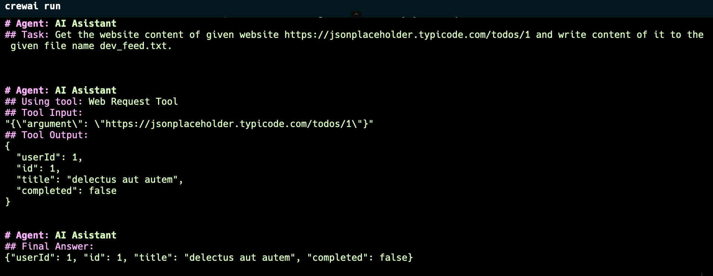

# Agent Frameworks

## Smolagents

It is straightforward to get into. Easy write an agent. Small feature set.
No memory or retriever support currently.

## Phidata

More comprehensive than Smolagents, has built-in tool set. It is easy to write RAG applications with built-in RAG tools and retrievers.

## CrewAI

Complex, requires more setup step. Achieves the result but it takes more time to built what you want to do.



# Running Code Examples

Note: Do not forget to fill api key for your gemini or custom llm apis.

## Installing Ollama Models

```
ollama install llama3
ollama install qwen2.5-coder
ollama install openhermes
```

## Creating Conda Environment

```
conda create -n agents python=3.10
conda activate agents

pip install smolagents
pip install -U phidata
pip install crewai crewai-tools

pip install pypdf

```

## RAG Requirements

```
pip install ollama
pip install pgvector
pip install pypdf
pip install psycopg2
conda install -c conda-forge psycopg
```

### Running PG Database

```
docker run -d \
  -e POSTGRES_DB=ai \
  -e POSTGRES_USER=ai \
  -e POSTGRES_PASSWORD=ai \
  -e PGDATA=/var/lib/postgresql/data/pgdata \
  -v pgvolume:/var/lib/postgresql/data \
  -p 5532:5432 \
  --name pgvector \
  phidata/pgvector:16
```

# Run Example Agents
```
cd smolagents
python3 main.py

cd phidata
python3 main.py

cd crewai
crewai run
```